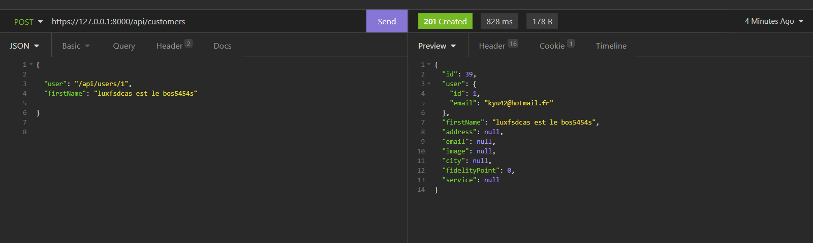

## MAILTRAP
```bash
utilisation de mailtrap avec mon mail pro, modiffication .env MAIL DNS  a modifier
```
## MAIL
 ```shell 
 MailerInterface $mailer
 ```
## RESET PASWWORD 
```shell
 composer require symfonycasts/reset-password-bundle
    .....
 php bin/console make:reset-password

 email reset password pro.lucas.girard@gmail.com
 seulement les users 
```
## upload une image dans une BDD
```shell
#'code dans le typeform' 
 use Symfony\Component\Form\Extension\Core\Type\FileType;

#'code dans le builder'
    ->add('profilPicture', FileType::class, [
                'mapped' => false
            ])
    
# 'code dans le controller'
    use Symfony\Component\String\Slugger\SluggerInterface;

    /**
     * @Route("/new", name="candidate_new", methods={"GET","POST"})
     */
    public function new(Request $request, SluggerInterface $slugger): Response '->!!ne pas oublier SluggerInterface $slugger'
    {
        $candidate = new Candidate();
        $form = $this->createForm(CandidateType::class, $candidate);
        $form->handleRequest($request);

        if ($form->isSubmitted() && $form->isValid()) {
            $entityManager = $this->getDoctrine()->getManager();


            /** @var UploadedFile $file */
            $file = $form->get('profilPicture')->getData();

            if ($file){
                $originalFilename = pathinfo($file->getClientOriginalName(), PATHINFO_FILENAME);
               
                $safeFilename = $slugger->slug($originalFilename);
                $newFilename = $safeFilename.'-'.uniqid().'.'.$file->guessExtension();

                
                try {
                    $file->move(
                        $this->getParameter('pictures_directory'),
                        $newFilename
                    );
                } catch (FileException $e) {
                    $newFilename = 'error file upload';
                }

                $candidate->setProfilPicture($newFilename);
            }

            $entityManager->persist($candidate);
            $entityManager->flush();

            return $this->redirectToRoute('candidate_index');
        }

        return $this->render('candidate/new.html.twig', [
            'candidate' => $candidate,
            'form' => $form->createView(),
        ]);
    }

# 'mettre le dossier upload dans public ou autre, définir la chemin dans config/services.yaml
# expemple'
    parameters:
    pictures_directory: '%kernel.project_dir%/public/uploads/'


 ```
## liens vers la doc de symfony
    https://symfony.com/doc/current/controller/upload_file.html#creating-an-uploader-service
## save
```shell
    /**
     * @Route("/new", name="candidate_new", methods={"GET","POST"})
     */
    public function new(Request $request, SluggerInterface $slugger): Response
    {
        $candidate = new Candidate();
        $form = $this->createForm(CandidateType::class, $candidate);
        $form->handleRequest($request);

        if ($form->isSubmitted() && $form->isValid()) {
            $entityManager = $this->getDoctrine()->getManager();


            /** @var UploadedFile $file */
            $file = $form->get('profilPicture')->getData();
            $file = $form->get('cv')->getData();
           

            if ($file){
               $filename = $this->saveUploadedFile($savefile);
                $candidate->setProfilPicture($newFilename);
            }

            $entityManager->persist($candidate);
            $entityManager->flush();

            return $this->redirectToRoute('candidate_index');
        }

        return $this->render('candidate/new.html.twig', [
            'candidate' => $candidate,
            'form' => $form->createView(),
        ]);
    }


    $originalFilename = pathinfo($file->getClientOriginalName(), PATHINFO_FILENAME);
               
    $safeFilename = $slugger->slug($originalFilename);
    $newFilename = $safeFilename.'-'.uniqid().'.'.$file->guessExtension();

    
    try {
        $file->move(
            $this->getParameter('pictures_directory'),
            $newFilename
        );
    } catch (FileException $e) {
        $newFilename = 'error file upload';
    }
```
# Api PLatorm
## Commande pour installer Api PLatform 
```shell
symfony composer req api ou  composer req api 
```
## The Serialization Process Context, Groups and Relations.
### Configuration
```shell
## api/config/packages/framework.yaml
framework:
    serializer: { enable_annotations: true }
```


### @apiRessource()
```shell
Dans les entity faire une annotation avec @apiRessource() et use ApiPlatform\Core\Annotation\ApiResource; pour afficher les GET,POST ect ... en format JSON
sur la route /api. ou utiliser Insomnia
```


### Using Serialization Groups
```shell

use ApiPlatform\Core\Annotation\ApiResource;
use Symfony\Component\Serializer\Annotation\Groups;

* @ApiResource(
 *   
 *       normalizationContext={"groups"="customer"}       
 * )

 Dans les entity 
 * @Groups({"customer"})
```

 ### Filter
```shell
 pour afficher les liens entre les user et les customers en JSON, on applique un filtre avec @ApiFilter.

 use ApiPlatform\Core\Bridge\Doctrine\Orm\Filter\SearchFilter;

dans les annotations : * @ApiFilter( SearchFilter::class , properties={"user": "exact"});  

exemple : https://127.0.0.1:8000/api/customers?user=6 ;
```


### pagination
```shell

afficher seulement 3 customer par utilisateur, dans les annotation:
 @apiResource( paginationItemsPerPage = 2 )
```


## Faire un POST 
```shell

1- Dans Insomnia en forma JSON 
    Route: POST https://127.0.0.1:8000/api/customers
    {
        "firstName": "coucouc",
        "user": "/api/users/1"
    }

2- faire un un inspecter sur la page login avec email et password  pour récupérer le cookie de connection cela pour rentrer les donner en json avec Insomnia.

3- Recuperer la value du cookie, le name ( PHPSESSID) et le nom de domaine (localhost ou 127.0.0.1).

4- Dans Insomnia rentrer les donnée dans Cookies est Editer new cookies  " keys, value, domaine, expires et HttpOnly ".


5- Dans les annotations de l\'entity customer: 
    dans @ApiResource indiquer le chemain pour la création du dossier Api et controller et le crée le controller:  
    *       collectionOperations={
    *                              "GET", 
    *                              "POST"={
    *                                  "controller"=App\Controller\Api\CustomerCreateController::class 
    *                              }
    *                             },

6- Controller\Api\CustomerCreateController 
<?php

namespace App\Controller\Api;

use Symfony\Bundle\FrameworkBundle\Controller\AbstractController;
use Symfony\Component\Security\Core\Security;
use App\Entity\Customer;

class CustomerCreateController AbstractController
{
    public function __invoke( $data)
    {
        dd($data);
    }
}

Avec un dd on a un retour
```

```shell
<?php
namespace App\Controller\Api;

use App\Entity\Customer;
use Symfony\Bundle\FrameworkBundle\Controller\AbstractController;
use Symfony\Component\Security\Core\Security;
class CustomerCreateController extends AbstractController
{
    private $security;

    public function __construct(Security $security )
    {
        $this->security = $security; 
    }
    
    public function __invoke(Customer $data)
    {
        $data->setUser($this->security->getUser());
        
        return $data; 
    }
}
```
;

## SECURITY, PUT AND DELETE
```shell
1- Dans les Annotation de l\'entity customer -> @ApiResource mettre security afin que les users soit identifier ou supprimer:
        itemOperations={
 *                      "GET",
 *                      "PUT"={
 *                             "security"="is_granted('EDIT_CUSTOMER', object)",
 *                             "controller"=App\Controller\Api\CustomerCreateController::class 
 *                            },
 *                      "DELETE"={
 *                             "security"="is_granted('EDIT_CUSTOMER', object)",
 *                             "controller"=App\Controller\Api\CustomerCreateController::class 
 *                            },
 *                      },

 2- Crée un dossier voter dans Security pour que les users soit idendifier pour modifier un customer :
    namespace App\Security\Voter;

    use App\Entity\Customer;
    use App\Entity\User;
    use Symfony\Component\Security\Core\Authorization\Voter\Voter;
    use Symfony\Component\Security\Core\Authentication\Token\TokenInterface;

    class CustomersVoter extends Voter
    {
        const EDIT = 'EDIT_CUSTOMER'; 

        protected function supports(string $attribute, $subject)
        {
            return 
                $attribute === self::EDIT && 
                $subject instanceof Customer;
        }

        protected function voteOnAttribute(string $attribute, $subject, TokenInterface $token)
        {
            $user = $token->getUser();

            if (
                !$user instanceof User ||
                !$subject instanceof Customer
            ) {
                return false;
            }

            return $subject->getUser()->getId() === $user->getId();
        }
    }

    L\'orsque qu\'un autre utilisateur ou administrateur veut modifer ( soumettre) un champs, l\'accès lui sera refusé (denied), la permision à fonctionnner.  

 ```

## CONTRAINTE ET VERRIFICATION (hack)
```shell
Empecher un users de modifier les donnéee, si il y a compris la forme des objet alors on utilise l\'annotaion denormalizationContext cela va nous permetre ce qu\'autorise sur le POST et PUT :

Customer entity

@ApiResource(
   denormalizationContext={"groups"="createCustomer","updateCustomer"},
)

     /**
     * @ORM\Column(type="string", length=255, nullable=true)
     * @Groups({"customer","createCustomer","updateCustomer"})
     */
    
    private $firstName;

```

